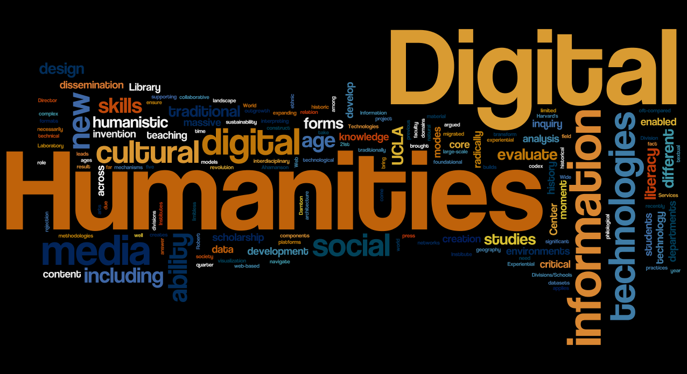

# IASC-2P02 | Katrina Lenselink

 
About Me:  
I am from a very small town called Harriston which usually no one has heard of. I am in second year IASC (kind of). I was in media comm first year and just switched into this program this year. So I am taking both first and second year courses at the moment. I really enjoy this program and I'm glad I made the switch. Below is a blog post about the necessity of combining humanities and science research methods.  

## Blog Post 

Digital Humanities and Science: Collaboration of Research Methods: [continue reading](blog)
