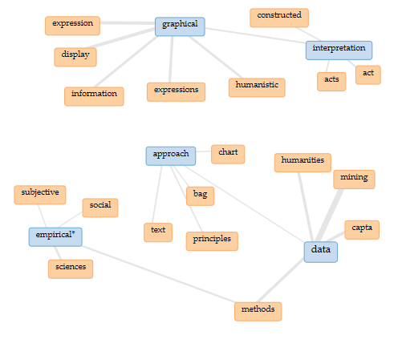

# Blog Post
## Prompt:
“As Kirschenbaum, Alvarado, and Ramsay have variously argued, the digital humanities draws from a number of established disciplines and research methods. This is a terrible idea. Digital humanities research attempts to combine two things that are fundamentally incompatible: the sciences and the humanities. Empirical or scientific approaches believe in objective facts that stand on their own; humanities approaches believe that all truth exists from a subjective, human perspective. These two approaches are fundamentally at odds with each other, and they can never be combined. Give it up, dh!”

### Digital Humanities and Science: Collaboration of Research Methods

The prompt above states the opinion that humanities should not utilize scientific approaches for research because the humanities are based upon subjective truth while science is based on objective fact. However, my argument is that these research approaches need to be combined because of how vastly different they are. The conflicting theories will help round out each discipline and ensure that the information that is researched and discussed is meaningful and factual. For example, scientific approaches already contain subjective thinking and it would be beneficial to accept and understand that fact in order to be more objective about the results that are produced. Also, scientific graphs can often be misleading as the results that are shown do not always give all the information needed. Secondly, the humanities would benefit from having a more objective view when analyzing text in order to make sure the interpretations start from an agreed upon fact. This blog post will discuss the merits of the sciences incorporating humanities’ interpretive nature into their graphs, as well as the advantages of the humanities expanding their methods to include objective approaches from the sciences.

Humanities would benefit from understanding that there are advantages to having objective fact in research, even though the humanities approach is to question the truth. “One might challenge the interpretation of the facts, or even the factual nature of the evidence, but from a rhetorical standpoint, facts are what permit or deny judgment” (Ramsay, 2011). People may not always agree on the meaning of a certain article or fact, however, there needs to be an underlying facet of truth and a foundation of hard evidence that can then be discussed and interpreted. This is especially important as the humanities expand their research into projects that require concrete data, such as data mining. Data mining is usually used in computer sciences for separating information from data sets to use for further study. This introduction to data mining will require the humanities to be more objective in the results they produce. In an article about data mining, Sculley and Pasanek argue that the data will be affected by the humanities’ ability to interpret everything and will complicate the results of the data with their biases. “We argue that in the digital humanities, the standards for the initial production of evidence should be even more rigorous than in the empirical sciences because of the subjective nature of the work that follows.” (Sculley & Pasanek, 2008). While it is important to not take everything at face value and be able to make your own meaning out of a text or data, it is essential that objective fact be taken into consideration and valued.  

Science would conversely benefit from more creativity in their graphs and being aware of the subjectivity already present in the graphs and results. This is a point that is well supported by Drucker’s ideas about rethinking graphical expressions from a humanities approach. Drucker argues that the sciences should adopt a more interpretive view when it comes to graphical visualizations. Drucker believes “the rendering of statistical information into graphical form gives it a simplicity and legibility that hides every aspect of the original interpretive framework on which the statistical data were constructed”. This is a point that will be explained using the visualization below.

Whenever an experiment is done and results are produced, there is always subjectivity and biases that come into play. As stated in Sculley and Pasanek (2008), “… experimenter assumptions operate at the forefront and directly impact the design of experiment and subsequent results”.  This visualization supports the argument that I’m making, not necessarily through the information shown in the graph, but by the process of creating the visualization itself. In creating this visualization, I was able to choose which keywords I wanted to use, as well as which form of graph I thought would best support my point. In the reasoning behind why I chose what I did, it was to have a graph that only showed the information that I wanted it to, to illustrate how researchers can bias a graph.  If someone else were to look at this visualization, they might interpret the information in a completely different way. For example, one interpretation of this graph based on what is shown could be that because ‘graphical’ is linked to ‘interpretation’ and ‘expression’ but not ‘empirical’ or ‘data’, it means that graphs should be more focused on the meaning that they represent, rather than the objectivity of the data in the graph. However, if I were to change the key words when creating the graph, the links could change and could lead to different interpretations of the same data. That is where the science approach may be useful in providing more objectivity in order to build off of concrete ideas and then add the interpretation. 

The information that these visualizations are portraying can also be misleading. By only showing the specific correlation of key words, it limits the connection of the papers down to word choice. If specific articles don’t use the exact same words the correlation might not show up on the visualization. There are different ways to express the same ideas and many connections that these papers could have, but it is hard to know for sure when the graphs don’t portray all the background information. This relates to Drucker’s ideas about how there is much more complex data that is often hidden underneath a simplistic graph and how if the sciences were to use more visual and creative graphs, the visualizations that occurred would be more representative of all the data collected.

While in theory it is possible to think that empirical facts can be separated from subjective thoughts, in practice they are inextricably linked.  Both science and the humanities can benefit by adopting research methods from each other in order to have information that is simultaneously a creative representation and an accurate one. 

### Works Cited

Drucker, J. 2011. Humanities approaches to graphical display. DHQ: Digital Humanities
Quarterly, 5. 

Ramsay, S. 2011. Reading machines. Retrieved from 
http://sites.uci.edu/digitalhumanitiesreadinggroup/files/2016/02/stephen-ramsay-reading-machines-toward-an-algorithmic-criticism.pdf

Sculley, D. & Pasanek B, M. (Dec 01, 2008). Meaning and mining: the impact of implicit 
assumptions in data mining for the humanities. Literary and Linguistic Computing, 23, 409-424. Retrieved from http://www.eecs.tufts.edu/~dsculley/papers/meaningAndMining.pdf 

